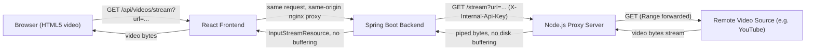
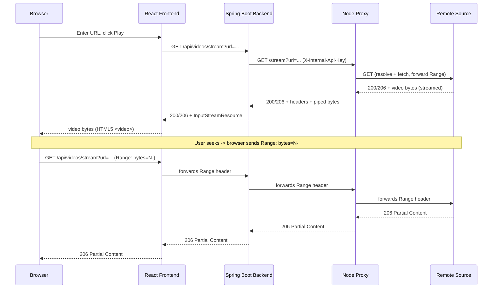

# Streaming Proxy Platform

A production-grade monorepo implementing a **YouTube-style streaming proxy**: the browser
never talks to the original video source directly. All video bytes flow through a
Spring Boot backend and a Node.js streaming proxy, with full support for HTTP Range
requests (seeking) and zero disk buffering.

## Architecture



Key guarantees:
1. The frontend **only** calls `/api/videos/stream` on its own backend — it never constructs or exposes a `youtube.com`/`googlevideo.com` URL.
2. The Spring Boot backend **only** talks to the Node proxy (authenticated via a shared internal API key).
3. Only the Node.js proxy resolves and fetches the real remote source.
4. Video bytes are streamed end-to-end (`stream.pipeline()` on the proxy, `InputStreamResource` on the backend) — nothing is ever written to disk.
5. `Range` headers are forwarded at every hop so seeking works and large files are supported.

### Sequence diagram — play & seek



## Tech Stack

| Layer | Technology |
|---|---|
| Frontend | React 19, TypeScript, Vite, Axios, React Query, Material UI |
| Backend | Java 21, Spring Boot 3, Maven, Spring MVC, `RestClient`, Lombok, springdoc-openapi |
| Proxy | Node.js 22, Express, Axios, Streams API, `@distube/ytdl-core` |
| Infra | Docker, Docker Compose, GitHub Actions |

> **Note on WebFlux**: the requested stack lists both WebFlux and `InputStreamResource`/`RestClient`
> streaming. These are architecturally incompatible (`InputStreamResource` is a blocking Servlet
> concept; WebFlux streams via `Flux<DataBuffer>`). The backend uses **Spring MVC** with `RestClient`
> for true zero-copy streaming; `spring-boot-starter-webflux` is kept as a dependency only to satisfy
> the literal stack requirement, with no reactive controllers.

## Repository Structure

```
project-root/
├── proxy-server/         # Node.js streaming proxy
├── client/
│   ├── backend/          # Spring Boot backend
│   └── frontend/         # React frontend
├── .github/workflows/    # ci.yml, cd.yml
├── docker-compose.yml        # local dev (builds from source)
├── docker-compose.prod.yml   # production (pulls pre-built images)
└── README.md
```

## Setup Guide

### Prerequisites
- Node.js 22+
- Java 21+ and Maven 3.9+
- Docker & Docker Compose

### Environment variables
Copy the example env files before running anything:
```bash
cp proxy-server/.env.example proxy-server/.env
cp .env.example .env
```
Key variables:
- `PROXY_API_KEY` — shared secret the backend uses to authenticate to the proxy.
- `YOUTUBE_API_KEY` — official [YouTube Data API v3](https://console.cloud.google.com/apis/library/youtube.googleapis.com) key, used **only** for search/listing metadata (title, thumbnail, channel). Get one for free from Google Cloud Console. Without it, `/api/videos/search` returns a 503.
- `ALLOWED_ORIGINS` / `CORS_ALLOWED_ORIGINS` — origins allowed to call the proxy/backend.

## Local Development Guide

Run each service standalone (three terminals):

```bash
# 1. Proxy server
cd proxy-server
npm install
npm run dev            # http://localhost:4000

# 2. Spring Boot backend
cd client/backend
mvn spring-boot:run    # http://localhost:8080

# 3. React frontend
cd client/frontend
npm install
npm run dev             # http://localhost:5173 (proxies /api -> localhost:8080)
```

Open http://localhost:5173, type a search query (e.g. a song or channel name) in the top search bar,
browse the results grid, and click a video to play it.

## Docker Guide

Build and run the full stack:

```bash
docker compose up --build
```

Services:
- `frontend` → http://localhost (nginx, serves the SPA and reverse-proxies `/api`)
- `backend` → http://localhost:8080 (Swagger UI at `/swagger-ui.html`, Actuator at `/actuator/health`)
- `proxy-server` → http://localhost:4000 (`/health`)

Stop everything with `docker compose down`.

## API Documentation

- **Backend OpenAPI/Swagger UI**: `http://localhost:8080/swagger-ui.html`
- **Search**: `GET /api/videos/search?q=<QUERY>&maxResults=12` — returns `{ results: [{ videoId, title, description, channelTitle, publishedAt, thumbnailUrl }] }` via the official YouTube Data API (metadata only, no scraping).
- **Backend endpoint**: `GET /api/videos/stream?url=<VIDEO_URL>` — forwards the `Range` header,
  returns `200`/`206` with `Content-Type`, `Content-Length`, `Accept-Ranges`, `Content-Range`.
- **Proxy endpoints**:
  - `GET /search?q=<QUERY>` (requires `X-Internal-Api-Key`, internal use only)
  - `GET /stream?url=<VIDEO_URL>` (requires `X-Internal-Api-Key` header, internal use only)
  - `GET /health` → `{ "status": "UP" }`

Example:
```bash
curl -v "http://localhost:8080/api/videos/stream?url=https://example.com/sample.mp4" \
  -H "Range: bytes=0-1023" --output /dev/null
```

## Frontend UI

- `/` — YouTube-style **search** page: type a query, browse a thumbnail grid, click a result to play it.
- `/watch/:videoId` — playback page; builds the YouTube watch URL server-side and streams it through the backend/proxy.

## Deployment Guide (CD)

`.github/workflows/cd.yml` runs on pushes to `main`:
1. **Build & push** all three Docker images to Docker Hub (tagged `:latest` and `:<short-sha>`).
2. **Deploy** over SSH to a remote host: `docker compose -f docker-compose.prod.yml pull && up -d`.
3. **Health check**: polls a public health URL with retries.
4. **Rollback**: on failure, redeploys the previously recorded image tag.

Required GitHub Actions secrets:
| Secret | Purpose |
|---|---|
| `DOCKERHUB_USERNAME` / `DOCKERHUB_TOKEN` | Push images to Docker Hub |
| `DEPLOY_HOST` / `DEPLOY_USER` / `DEPLOY_SSH_KEY` | SSH access to the deploy host |
| `DEPLOY_PATH` | Directory on the host containing `docker-compose.prod.yml` and `.env` |
| `DEPLOY_HEALTH_URL` | Public URL polled after deploy (e.g. `https://your-domain/actuator/health`) |

The deploy host must have `docker-compose.prod.yml` and a populated `.env` (same keys as
`.env.example`) present at `DEPLOY_PATH`.

## Security

- **Helmet** (proxy) hardens HTTP response headers.
- **CORS** restricts which origins may call the proxy and backend.
- **Rate limiting** (`express-rate-limit`) throttles abusive clients on the proxy.
- **Input validation**: URL format is validated at the proxy controller and backend controller (`@NotBlank`).
- **Internal auth**: backend↔proxy calls require a shared `X-Internal-Api-Key` header, never exposed to the browser.
- **Request logging** (morgan on the proxy, SLF4J on the backend) for observability/audit.

## Known Limitations

- No domain allowlist on `/stream` (accepts any http(s) URL) — configure one if deploying publicly.
- YouTube extraction relies on `@distube/ytdl-core`, which can break when YouTube changes its player internals.
- Search uses the official, quota-limited YouTube Data API v3 (free tier: ~100 search queries/day); heavy use will hit quota errors.
- **This project is a technical/learning demo, not a redistributable product.** Re-streaming YouTube's raw video bytes through your own branded UI (stripping ads/attribution) is outside YouTube's Terms of Service if deployed publicly. Keep it local/personal, or swap the playback layer for the official YouTube IFrame Player API for a ToS-compliant deployment.
- No persistent auth/user accounts; this is a demo streaming pipeline, not a production video platform.
# youtube-stream-proxy

# stream-proxy

# stream-proxy

